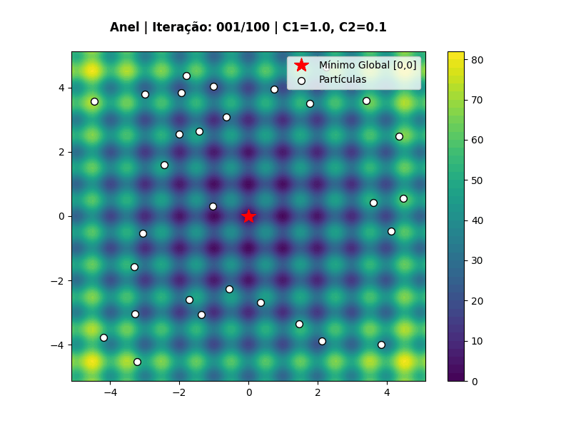
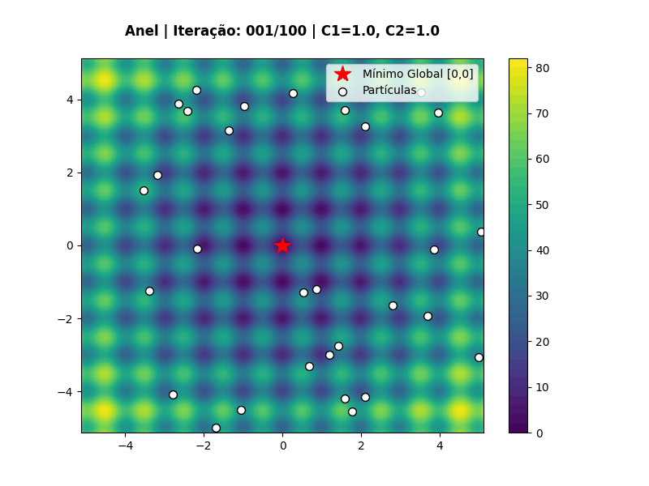

# PSO

Implementação de Particle Swarm Optimization aplicada à função de Rastrigin em 2 dimensões, com geração de animações para diferentes combinações de parâmetros.

## Resultados

Os GIFs abaixo mostram a evolução do enxame para cada par de parâmetros $C1$ e $C2$.

### Galeria de gráficos

| C1 | C2 | Gráfico |
|---|---:|---|
| 0 | 1 |  |
| 1 | 0 |  |
| 1 | 0.1 |  |
| 1 | 1 |  |
| 2 | 2 |  |
| 4 | 4 |  |

## Observações

- O objetivo é minimizar a função de Rastrigin, cujo mínimo global está em $(0, 0)$.
- Os GIFs foram organizados por combinação de parâmetros para facilitar a comparação visual do comportamento do enxame.
